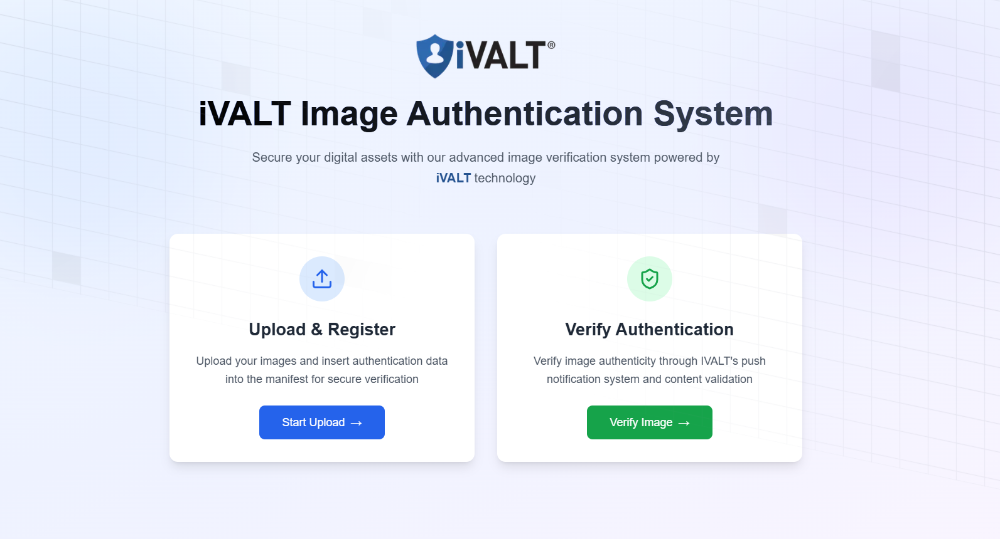

# iVALT C2PA Image Verification Project



This project involves embedding data, such as a mobile number and name, into images, as well as a verification feature that reads manifest data from an image and sends an authentication request to the iVALT app for biometric verification.

## Prerequisites

- Ensure Docker is installed on your system. If not, download and install Docker from [Docker's official site](https://www.docker.com/).

## Getting Started

### 1. Clone the Repository

Clone the project repository from your version control system:

```bash
git clone https://github.com/jaskaran-ivalt/ivalt-c2pa.git
cd ivalt-c2pa
```

---

## Setup Environment Variables
### 2. Setup Environment Variables

Here's an updated section for the README file, including details about the `.env.example` file and the command to copy it:


1. A sample `.env.example` file is provided in the project to help you set up the necessary environment variables.

2. To create your `.env` file from the example, run the following command:

   ```bash
   cp .env.example .env
   ```

3. Open the newly created `.env` file and fill in the required values:

   ```env
   # Example .env file
   # iVALT API Configuration
   IVALT_PRO_API_URL=<your-ivalt-pro-api-url>
   IVALT_PRO_API_KEY=<your-ivalt-pro-api-key>
   ```

   - **Replace** `<your-ivalt-api-key>`and `<your-ivalt-pro-api-url>` with actual values needed for your setup.

---

## Docker Setup

### 3. Dockerfile

The `Dockerfile` is already provided in the project and uses the following content:
```Dockerfile
FROM jass4704/ivalt-c2pa:latest
```

### 4. Build the Docker Image

If you have made changes to the code or want to build the image locally, you can use the following command:

```bash
docker build -t ivalt-c2pa-local .
```

- `-t ivalt-c2pa-local`: Tags the image with the name `ivalt-c2pa-local`.

### 5. Run the Docker Container

Run the container with the appropriate environment variables and port mapping:

```bash
docker run -d --env-file .env -p 3000:3000 ivalt-c2pa-local
```

Alternatively, if you want to use the pre-built image from Docker Hub:

```bash
docker run -d --env-file .env -p 3000:3000 jass4704/ivalt-c2pa:latest
```

- `-d`: Runs the container in detached mode (in the background).
- `--env-file .env`: Loads environment variables from the `.env` file.
- `-p 3000:3000`: Maps port 3000 on your local machine to port 3000 on the container.

### 6. Access the Application

Once the container is running, access the application in your web browser at:

```
http://localhost:3000
```

## Additional Information

- **Environment Variables**: Ensure that all necessary environment variables are correctly set in the `.env` file. The application depends on these for proper functionality.
- **Biometric Verification**: This project integrates with the iVALT app for biometric verification. Ensure the iVALT app is configured to handle authentication requests.
- **Viewing Logs**: To view logs or debug issues, run:

  ```bash
  docker logs <container-id>
  ```

- **Stopping the Container**: Use the following command to stop the running container:

  ```bash
  docker stop <container-id>
  ```